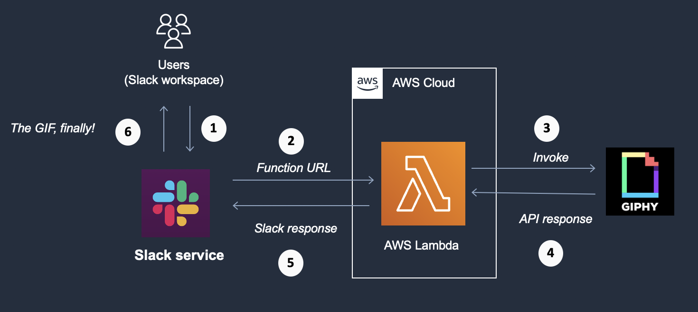

# Using AWS Lambda Function URL to build a Serverless backend for Slack

Sample app to demonstrate how to use Lambda function URL with a practical example. You will build a [Go Lambda function](https://docs.aws.amazon.com/lambda/latest/dg/lambda-golang.html) to serve as a serverless webhook backend for [Slack](https://slack.com/).

- Part 1 covers solution architecture along with deployment - refer to this [blog post](https://abhishek1987.medium.com/using-aws-lambda-function-url-to-build-a-serverless-backend-for-slack-a292ef355a5d)
- Part 2 covers IaaC based deployment using AWS CDK. Details in [this blog post](https://abhishek1987.medium.com/package-and-deploy-a-lambda-function-as-a-docker-container-with-aws-cdk-fd0df5e37de7).

